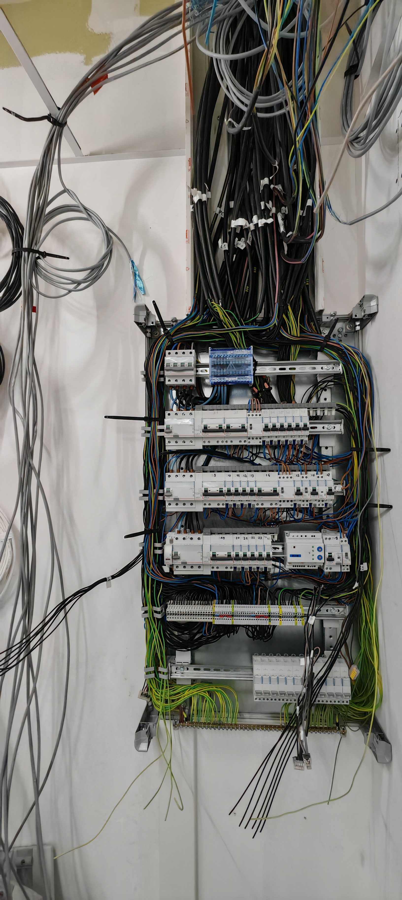

# 🖼️ Guide d'optimisation des images - Red Den Connexion

## 📊 Diagnostic initial

### Images trop lourdes identifiées :

| Fichier | Taille actuelle | Problème |
|---------|----------------|----------|
| `boitier4prises.jpg` | **2.5 MB** | 🔴 Trop lourd |
| `tableauhallescoutras.jpg` | **2.0 MB** | 🔴 Trop lourd |
| `installationpro.jpg` | **1.6 MB** | 🔴 Trop lourd |
| `mutiprises.png` | **1.4 MB** | 🔴 Trop lourd |
| `imagedeniselec.png` | **1.2 MB** | 🔴 Trop lourd |
| `logo.png` | **1.2 MB** | 🔴 Trop lourd |
| `dangervssecurite.jpg` | **1.1 MB** | 🔴 Trop lourd |
| `logoredden.png` | **864 KB** | 🟡 Optimisable |
| `ProfilePhoto.png` | **832 KB** | 🟡 Optimisable |

**Poids total actuel : ~11.6 MB**
**Objectif après optimisation : ~3-4 MB** (réduction de 65-70%)

---

## ✅ Optimisations déjà en place

### 1. Preload des images critiques ✅
```html
<!-- Ajouté dans index.html ligne 40-42 -->
<link rel="preload" as="image" href="logoredden.png" type="image/png">
<link rel="preload" as="image" href="deniselec.png" type="image/png">
```

**Bénéfice** : Le navigateur charge ces images en priorité avant même de parser le HTML

### 2. Lazy loading des images non critiques ✅
```html
<!-- Déjà présent sur toutes les images de la galerie -->

```

**Bénéfice** : Les images hors écran ne se chargent que quand l'utilisateur scrolle

---

## 🚀 Scripts d'optimisation créés

### Script 1 : `optimize-images.sh` - Compression automatique

**Utilisation** :
```bash
# 1. Installer ImageMagick (si pas déjà installé)
# Ubuntu/Debian :
sudo apt update
sudo apt install imagemagick optipng

# macOS :
brew install imagemagick optipng

# 2. Lancer le script
./optimize-images.sh
```

**Ce que fait le script** :
- ✅ Sauvegarde automatique des originaux dans `images-originales-backup/`
- ✅ Compression JPG à 85% de qualité (excellent compromis qualité/poids)
- ✅ Compression PNG optimale (niveau 9)
- ✅ Suppression des métadonnées EXIF inutiles
- ✅ Conversion en JPEG progressif (meilleur chargement)
- ✅ Affichage détaillé des gains de poids

**Réduction attendue** :
- JPG : **50-70% de réduction** (2.5MB → 750KB-1.25MB)
- PNG : **30-50% de réduction** (1.2MB → 600-850KB)

---

### Script 2 : `convert-to-webp.sh` - Format WebP (bonus)

**Utilisation** :
```bash
# 1. Installer les outils WebP
# Ubuntu/Debian :
sudo apt install webp

# macOS :
brew install webp

# 2. Lancer le script
./convert-to-webp.sh
```

**Ce que fait le script** :
- ✅ Convertit toutes les images en WebP (format Google ultra-optimisé)
- ✅ Qualité 85% (identique visuel, 25-35% plus léger que JPG)
- ✅ Sauvegarde dans `images-webp/`
- ✅ Compatible avec 95% des navigateurs modernes

**Réduction attendue** :
- **25-35% plus léger** que les JPG/PNG déjà optimisés
- Exemple : 750KB JPG → 500KB WebP

---

## 📝 Plan d'action recommandé

### Étape 1 : Optimiser les images existantes (OBLIGATOIRE)

```bash
# 1. Installer ImageMagick
sudo apt install imagemagick optipng  # ou brew sur macOS

# 2. Lancer l'optimisation
./optimize-images.sh

# 3. Vérifier les images optimisées
ls -lh images-optimisees/

# 4. Comparer visuellement (ouvrir dans navigateur)
open images-optimisees/boitier4prises.jpg
open boitier4prises.jpg

# 5. Si satisfait, remplacer les originaux
cp images-optimisees/* .

# 6. Vérifier les nouveaux poids
ls -lh *.jpg *.png
```

**Temps estimé** : 5 minutes
**Gain** : **~6-8 MB de réduction** (65-70%)

---

### Étape 2 : Convertir en WebP (OPTIONNEL - gain supplémentaire)

```bash
# 1. Installer cwebp
sudo apt install webp  # ou brew install webp sur macOS

# 2. Lancer la conversion
./convert-to-webp.sh

# 3. Copier les WebP dans le dossier principal
cp images-webp/* .

# 4. Modifier le HTML pour utiliser WebP avec fallback
# Voir ci-dessous
```

**Temps estimé** : 10 minutes (+ modifications HTML)
**Gain supplémentaire** : **~1-2 MB de réduction** (25-35%)

---

## 🔧 Modifications HTML pour WebP (optionnel)

### Méthode 1 : Balise `<picture>` avec fallback automatique

**Avant** :
```html

```

**Après** :
```html
<picture>
  <source srcset="tableauhallescoutras.webp" type="image/webp">
  
</picture>
```

**Avantages** :
- ✅ Navigateurs modernes (Chrome, Firefox, Edge) → WebP (plus léger)
- ✅ Anciens navigateurs → JPG/PNG (fallback)
- ✅ Aucun JavaScript nécessaire
- ✅ Compatible SEO

---

### Méthode 2 : Modifier tout le HTML automatiquement

Créer un script `update-html-webp.sh` :

```bash
#!/bin/bash

# Sauvegarder index.html
cp index.html index.html.backup

# Remplacer toutes les images de la galerie par <picture>
# (À adapter selon vos besoins)

echo "HTML mis à jour avec WebP + fallback"
```

---

## 📈 Résultats attendus

### Avant optimisation :
- **Poids total** : ~11.6 MB
- **Temps de chargement** : 5-8 secondes (3G)
- **Score Lighthouse Performance** : 60-70/100

### Après optimisation (JPG/PNG optimisés) :
- **Poids total** : ~3.5-4.5 MB (**-65%**)
- **Temps de chargement** : 2-3 secondes (3G)
- **Score Lighthouse Performance** : 80-85/100

### Après optimisation + WebP :
- **Poids total** : ~2.5-3.5 MB (**-75%**)
- **Temps de chargement** : 1.5-2.5 secondes (3G)
- **Score Lighthouse Performance** : 85-95/100

---

## 🎯 Checklist finale

- [x] Script `optimize-images.sh` créé
- [x] Script `convert-to-webp.sh` créé
- [x] Preload des images critiques ajouté
- [x] Lazy loading vérifié (déjà en place)
- [ ] **À FAIRE : Lancer `optimize-images.sh`**
- [ ] **À FAIRE : Vérifier qualité des images optimisées**
- [ ] **À FAIRE : Remplacer les originaux par les optimisés**
- [ ] **OPTIONNEL : Convertir en WebP**
- [ ] **OPTIONNEL : Modifier HTML pour WebP**
- [ ] Tester le site avec Lighthouse
- [ ] Committer les changements

---

## 🧪 Tester les performances

```bash
# 1. Installer Lighthouse CLI (optionnel)
npm install -g lighthouse

# 2. Tester votre site
lighthouse https://reddenconnexion.github.io/ --view

# Ou utiliser PageSpeed Insights :
# https://pagespeed.web.dev/
```

---

## ⚠️ Points d'attention

1. **Toujours vérifier visuellement** les images optimisées avant de remplacer les originaux
2. **Les originaux sont sauvegardés** dans `images-originales-backup/`
3. **Ne pas optimiser plusieurs fois** la même image (perte de qualité)
4. **WebP nécessite fallback** pour les vieux navigateurs (<5% des utilisateurs)
5. **Preload limité** : max 2-3 images critiques (sinon contreproductif)

---

## 📞 Support

Si vous avez des questions ou problèmes :
1. Vérifier les logs des scripts
2. Tester avec une seule image d'abord
3. S'assurer qu'ImageMagick/cwebp sont bien installés

**Bon courage pour l'optimisation ! 🚀**
